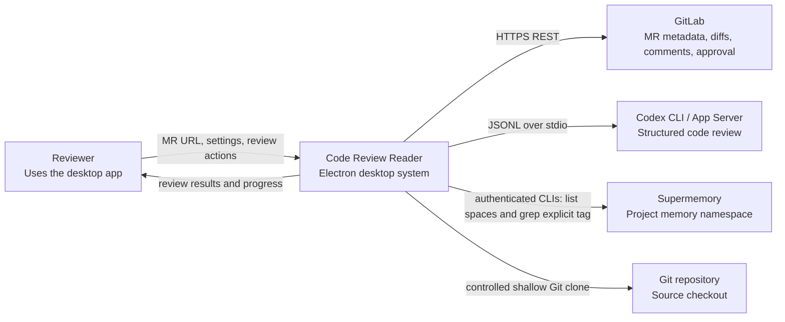
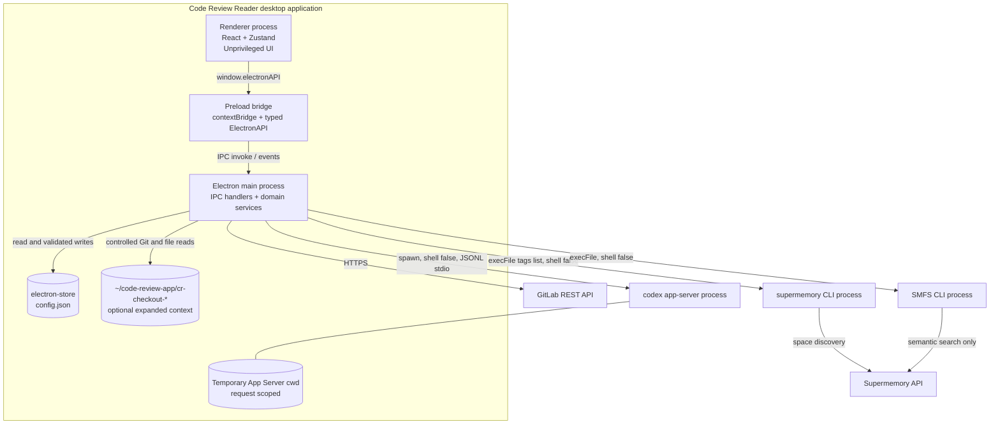
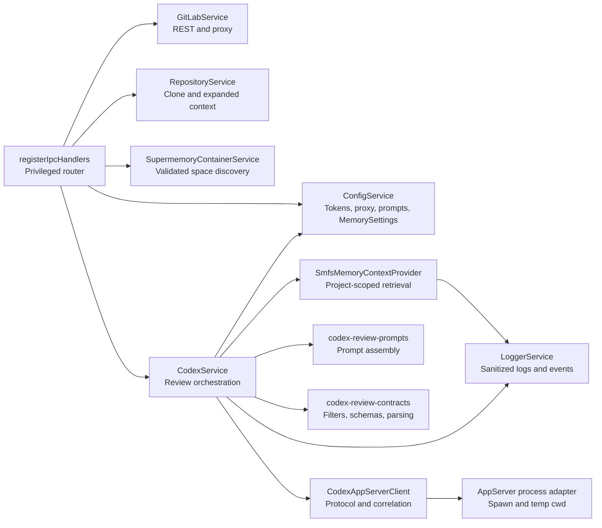
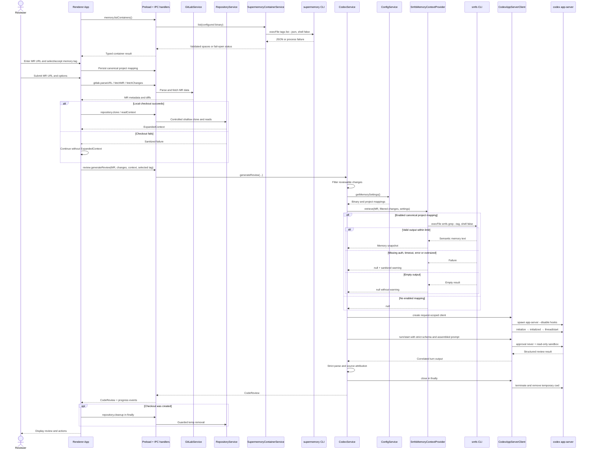
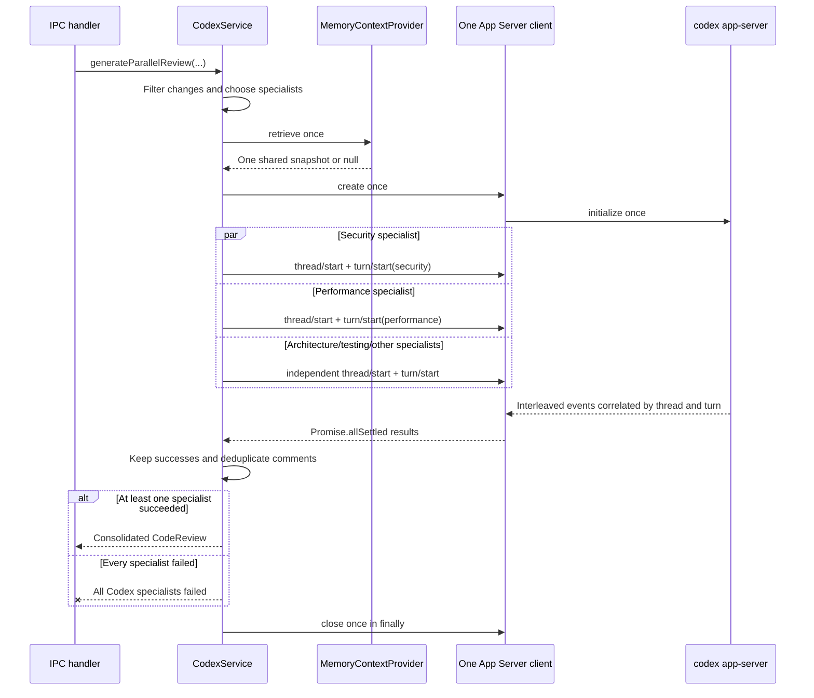
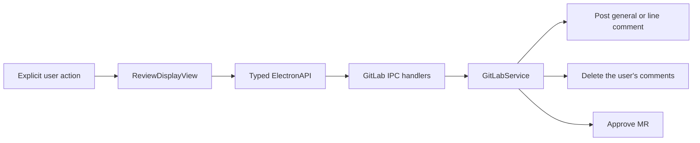
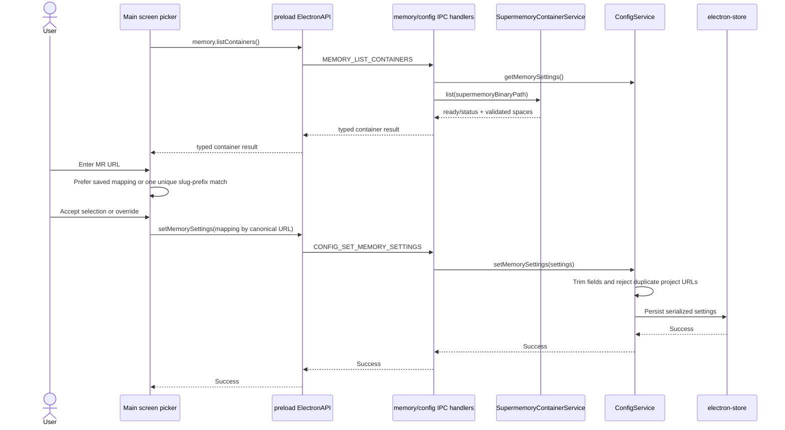
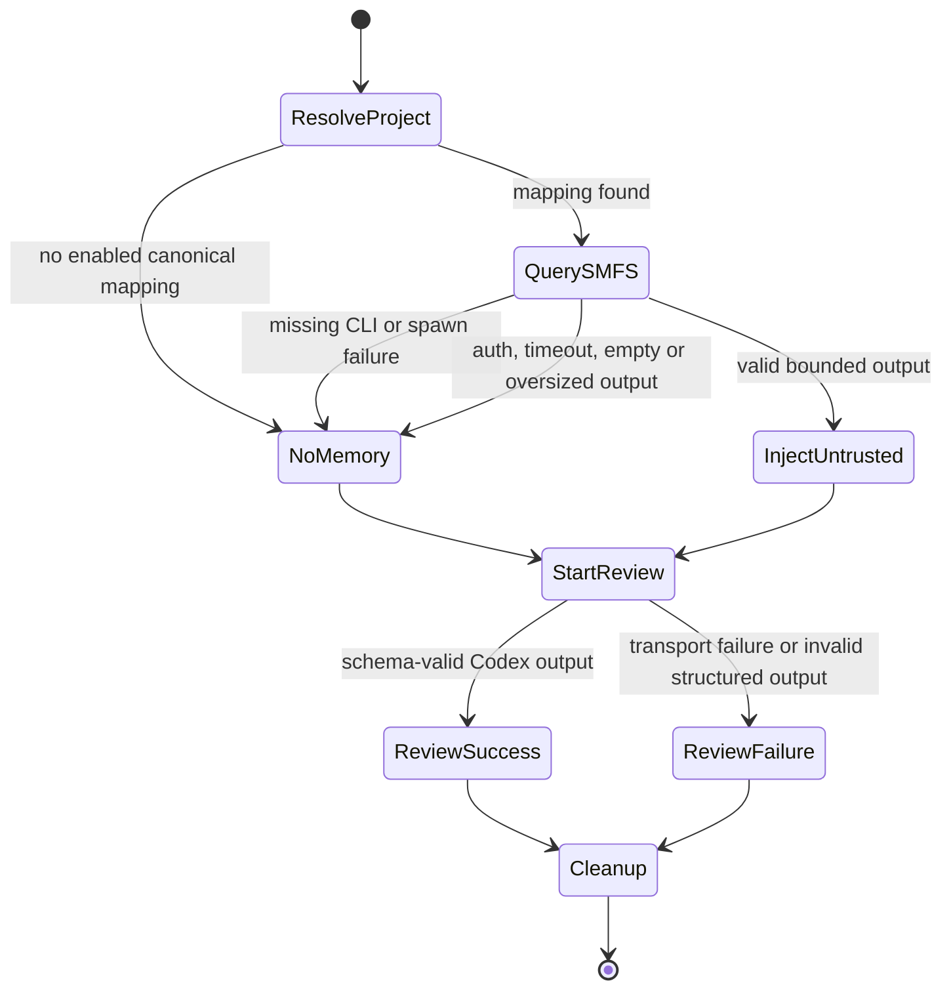
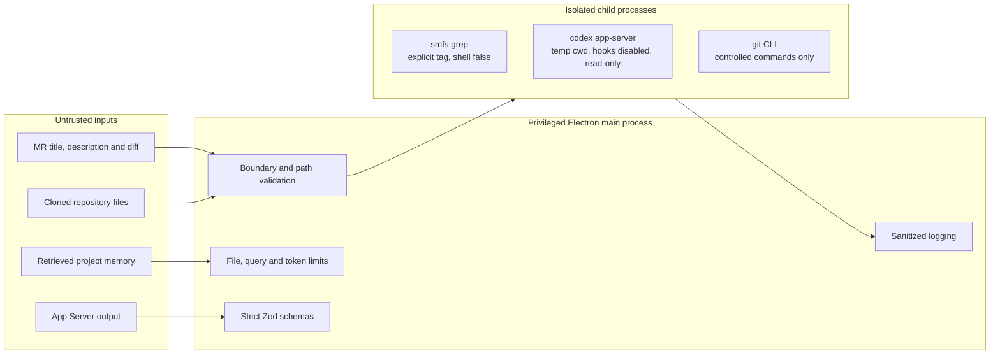

# Agent Architecture Guide

This guide is the operational architecture map for coding agents changing the application. It complements [Architecture](./ARCHITECTURE.md), [Services](./SERVICES.md), the root `AGENTS.md`, and the scoped `AGENTS.md` files.

## Authoritative entrypoints

| Concern | Authority | Preserve |
|---|---|---|
| Renderer workflow | `src/renderer/App.tsx` | MR validation, memory selection, always-attempted checkout, progress reset, checkout cleanup in `finally` |
| Privilege bridge | `src/main/preload.ts` | Narrow typed API; never expose raw `ipcRenderer` |
| IPC routing | `src/main/ipc/handlers.ts` | Boundary validation, window-scoped progress, service delegation |
| Shared IPC contract | `src/shared/types/constants/ipc.ts`, `src/shared/types/` | Synchronize all seven IPC surfaces |
| Review orchestration | `src/main/services/codex.service.ts` | One request-scoped client; one memory lookup per review |
| Project memory | `src/main/services/memory-container.service.ts`, `memory-context.provider.ts` | Shell-free discovery/query, explicit `--tag`, bounded fail-open output |
| App Server transport | `src/main/services/codex-app-server.client.ts` | JSONL correlation, temporary cwd, `--disable hooks`, read-only sandbox |
| App Server process | `src/main/services/codex-app-server.process.ts` | `shell: false`, piped stdio, idempotent temp cleanup |
| Local repository context | `src/main/services/repository.service.ts` | Controlled Git only, path containment, token budgets, guarded cleanup |
| Persisted configuration | `src/main/services/config.service.ts` | Validated serialized settings; secrets remain sensitive |

## C4 level 1 — system context

Agent reading: the Electron application owns orchestration. Codex never talks directly to GitLab, the checkout, or SMFS. Memory is prefetched by the main process and becomes untrusted prompt data.

## C4 level 2 — containers and processes

Deployment facts agents must not blur:

- Browser/Playwright uses `mockElectronAPI`; it does not prove real IPC, native cleanup, credentials, SMFS, or Codex.
- `electron-store` encryption is reversible obfuscation, not keychain security.
- The App Server cwd remains in the OS temporary area; repository checkouts use isolated children under `~/code-review-app`.
- The app uses existing CLI sessions; it does not mount, authenticate, store API keys, or write through SMFS.

## C4 level 3 — main-process components

Component ownership rules:

- IPC handlers validate payloads where boundary checks exist today; services must still treat every input as untrusted and enforce domain invariants. Do not assume all legacy handlers have structural validation.
- `CodexService` retrieves memory before creating review threads and reuses the snapshot across specialists.
- `SmfsMemoryContextProvider` does not know Electron or renderer state.
- Prompt code labels memory as `PROJECT MEMORY — UNTRUSTED REFERENCE` and escapes Markdown fence backticks.
- Transport code owns lifecycle cleanup; review code closes every client in `finally`.

## Sequence — standard review

## Sequence — parallel specialists

This path is implemented in the preload, IPC handler, and `CodexService`, but the current production `App.tsx` submit flow calls only `generateReview`. Treat parallel review as an available service contract, not as the default UI path.

Never move memory retrieval inside the specialist loop. Never share a client across separate top-level reviews.

## Post-review write actions

Generating a review does not authorize these GitLab writes. They remain separate, explicit UI actions.

## Sequence — project memory selection

An IPC settings change must update all seven surfaces: constants, handlers, preload, renderer declaration, browser mock, test setup, and handler/renderer tests.

## Failure model — memory is fail-open, review is schema-strict

The asymmetry is intentional: memory availability must not block a review, while malformed model output must not be accepted as a valid review.

## Trust boundaries and data classification

## Agent change routing

| If changing… | Inspect and update… | Required focused proof |
|---|---|---|
| Review input/output | shared review types, contracts, prompts, service, fixtures, renderer consumers | schema tests + service tests + typecheck |
| IPC method/payload | all seven IPC surfaces | handler tests + renderer tests + main/renderer builds |
| SMFS matching/query | settings types, ConfigService, provider, prompt, services docs | provider/config/service tests; prove fail-open and query count |
| App Server protocol | client, protocol, state, errors, process adapter | ordering, correlation, timeout and cleanup tests |
| Checkout context | RepositoryService, renderer `finally`, repository types | path containment, budget and cleanup tests |
| Settings UI | section/editor, preload API, mock, accessibility tests | labels, save/error feedback and browser mock behavior |

## Separate executable boundary

`src/tools/mcp-gitlab-commenter/` is an independently compiled stdio MCP tool. It is not part of the renderer → preload → main review path and has its own scoped `AGENTS.md`, TypeScript target, posting pipeline, and tests. Do not route desktop review orchestration through it or merge its contracts into the Electron preload API.

## Non-negotiable invariants

- Keep the runtime Codex-only; do not reintroduce Copilot or Claude providers.
- Never expose raw `ipcRenderer` or import main-process implementations into renderer code.
- Never run package managers, hooks, builds, interpreters, or repository scripts from a clone.
- Never pass memory mounts or the repository checkout as the App Server cwd.
- Never let the App Server invoke SMFS directly; memory remains prefetched prompt context.
- Never pass API keys on SMFS command arguments or log queries, memory content, credentials, or raw stderr.
- Keep `--disable hooks`, `approvalPolicy: 'never'`, the read-only sandbox, request-scoped temporary cwd, and `finally` cleanup.
- Keep repository-specific lock behavior outside this application.
